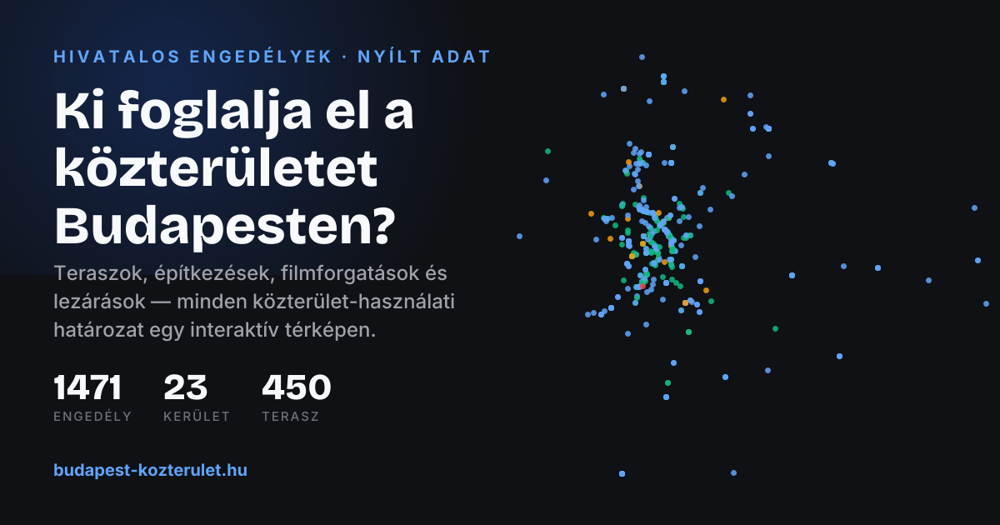

<div align="center">

# 🗺️ Budapest Public Space Map

### *Ki foglalja el a közterületet Budapesten?*

**An open-source civic-tech map of every public-space usage permit in Budapest** — restaurant terraces, construction sites, film shoots and street closures, built from official municipal decision records.

[](https://nextjs.org)
[](https://react.dev)
[](https://leafletjs.com)
[](LICENSE)
[](data/)



</div>

---

## What is this?

Budapest's streets fill up every day with terraces, construction containers and film-shoot closures — but **who got a permit, for what, and until when?**

This project takes the official public-space usage decisions (*közterület-használati határozatok*) published by the Municipality of Budapest as a raw Excel sheet, and turns them into something citizens can actually use:

- 🗺️ **Interactive map** of ~1,500 geocoded permits (Leaflet, marker clustering, heatmap overlay)
- 🔍 **Filters** by district, usage category, company and permit status (active / expiring / expired)
- 🎨 **Color modes** — color the map by expiry, category, company, size or start date
- 📋 **Sortable table view** of the full dataset
- 📄 **A dedicated SEO page for every permit** with structured data (FAQ JSON-LD), unique metadata and a **generated Open Graph share card**
- 🌗 Dark / light / satellite / terrain base maps

**The full data pipeline is included** — from the original XLSX (in [`data/`](data/)) through the Python cleaning/geocoding scripts (in [`scripts/`](scripts/)) to the final [`public/data.json`](public/data.json).

## Tech stack

| Layer | Tools |
|---|---|
| Framework | Next.js 16 (App Router), React 19, TypeScript |
| Map | Leaflet, react-leaflet, marker clustering, leaflet.heat |
| UI | MUI v9, Tailwind CSS v4 |
| Share images | `next/og` (Satori) — generated 1200×630 cards for the home page and every permit |
| SEO | Per-page metadata, canonical URLs, `sitemap.xml` (~1,500 URLs), `robots.txt`, JSON-LD (WebSite, Organization, Dataset, FAQ) |
| Data pipeline | Python (pandas-free, stdlib + requests), Photon & Nominatim geocoding |

## Getting started

```bash
npm install
npm run dev
```

Open [http://localhost:3000](http://localhost:3000).

### Configuration

Copy `.env.example` to `.env.local` and set your domain:

```bash
NEXT_PUBLIC_SITE_URL=https://your-domain.hu
```

Everything domain-dependent — canonical URLs, Open Graph images, `sitemap.xml`, `robots.txt`, JSON-LD — derives from this single variable (see [`lib/site.ts`](lib/site.ts)). No other change is needed to go live on any domain.

## Deploying on a .hu domain

The site is a standard Next.js app — Vercel is the zero-config path:

1. Import the GitHub repo into [Vercel](https://vercel.com/new) → deploy (no settings needed).
2. Buy your `.hu` domain at any Hungarian registrar (e.g. forpsi.hu, rackhost.hu, tarhely.eu).
3. In Vercel → Project → Settings → Domains, add the domain, then at the registrar set the DNS records Vercel shows you (an `A` record for the apex + a `CNAME` for `www`).
4. Set `NEXT_PUBLIC_SITE_URL=https://your-domain.hu` in Vercel → Settings → Environment Variables and redeploy.

Full step-by-step guide (including registrar specifics and Google Search Console setup): [docs/DEPLOYMENT.md](docs/DEPLOYMENT.md).

## Data pipeline

```
data/kozterulet-hasznalati-hatarozatok.xlsx     ← original official records
        │  parse + clean + categorize
        ▼
scripts/get_districts.py                        ← district bounding boxes (Nominatim)
scripts/geocode_advanced.py                     ← address → lat/lon (Photon + bbox validation)
scripts/fix_script.py                           ← manual geo corrections (e.g. Margitsziget)
scripts/generate_slugs.py                       ← SEO-friendly URL slugs
        ▼
public/data.json                                ← what the app renders
```

Run the scripts from the repository root, e.g. `python3 scripts/generate_slugs.py`.

### ⚠️ Data disclaimer

All data is **informational only**. Coordinates come from automated geocoding of free-text addresses and may be imprecise; permit statuses may have changed since publication. The dataset reflects the official records at the time of export.

## Hungarian summary / Magyar összefoglaló

Nyílt forráskódú civic-tech projekt, amely Budapest hivatalos közterület-használati határozatait teszi böngészhetővé: interaktív térkép, szűrők kerület / kategória / cég / státusz szerint, kereshető lista, valamint minden engedélyhez saját, keresőbarát aloldal. Az eredeti hivatalos táblázat és a teljes adatfeldolgozó kód is része a repónak. Az adatok tájékoztató jellegűek.

## About the author

Built by **[Gergely Kovács](https://gregorysmith.eu)** — founder of **Bonvo Consulting Kft.**, a Budapest-based consulting studio.

> **This site went from a raw Excel sheet to a production, SEO-optimized data product in days.** We do this for clients too: deep data analysis and research to find a competitive edge in any market, plus full-service contract development — web & mobile apps, data platforms, and data-driven marketing. **[Get in touch →](mailto:kovigerri@gmail.com)**

| | |
|---|---|
| 🌐 Portfolio | [gregorysmith.eu](https://gregorysmith.eu) |
| 💼 LinkedIn | [linkedin.com/in/kovacsgeri](https://www.linkedin.com/in/kovacsgeri/) |
| 🎿 Bonvo Ski (app) | [bonvo.ski](https://bonvo.ski) · [App Store](https://apps.apple.com/app/bonvo-ski-3d-ski-snowboard/id6753033871) |
| 🏢 Bonvo for Business | [business.bonvo.ski](https://business.bonvo.ski) |
| 📸 Instagram | [@bonvo.ski](https://www.instagram.com/bonvo.ski/) |

## License

Code is released under the [MIT License](LICENSE). The underlying permit records are public municipal data; map data © [OpenStreetMap](https://www.openstreetmap.org/copyright) contributors.
